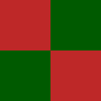

# Hacker News Holiday Colors Extension

  

A browser extension that brings the festive Christmas colors to Hacker News throughout the entire holiday season, not just on Christmas Day.

## Features

- Automatically applies red and green alternating colors to story numbers on Hacker News
- Changes the top banner to a festive red color
- Active from the day after Thanksgiving through the first workday of the new year
- Works on all pages under news.ycombinator.com
- Compatible with Chrome and Firefox
- Customizable settings with four modes:
  - Default: Active only during holiday season
  - Always On: Christmas colors year-round
  - Always Off: Disable Christmas colors completely
  - Extra Festive: Animated colors with festive GIF decoration

## Installation

### Chrome
1. Open Chrome and navigate to `chrome://extensions/`
2. Enable "Developer mode" in the top right corner
3. Click "Load unpacked"
4. Select this extension's directory
5. The extension will now be active when browsing Hacker News during the holiday season
6. Click the extension icon in the toolbar to access settings and switch between modes

### Firefox
1. Open Firefox and navigate to `about:debugging`
2. Click "This Firefox" on the left sidebar
3. Click "Load Temporary Add-on"
4. Select the `manifest.json` file from this extension's directory
5. The extension will now be active when browsing Hacker News during the holiday season
6. Click the extension icon in the toolbar to access settings and switch between modes

## How It Works

The extension:
- Detects if the current date falls within the holiday season (day after Thanksgiving through first workday of January)
- Applies CSS to alternate story ranking numbers between red (#be2828) and green (#005a00)
- Changes the top banner color to festive red (#cc1010)
- Only activates on news.ycombinator.com domains
- Provides a popup interface to switch between four modes:
  - **Default**: Follows holiday season schedule
  - **Always On**: Keeps Christmas colors active year-round
  - **Always Off**: Disables Christmas colors regardless of date
  - **Extra Festive**: Animated alternating colors (every 2 seconds) plus animated Christmas tree GIF at top of page

## Files

- `manifest.json` - Extension configuration
- `content.js` - JavaScript that checks dates and applies the holiday theme
- `christmas.css` - CSS rules for the red/green color alternation
- `popup.html` - Settings popup interface
- `popup.js` - Settings popup logic
- `popup.css` - Settings popup styling
- `icon*.png` - Extension icons in multiple sizes

## License

This project is licensed under the MIT License - see the [LICENSE](LICENSE) file for details.
