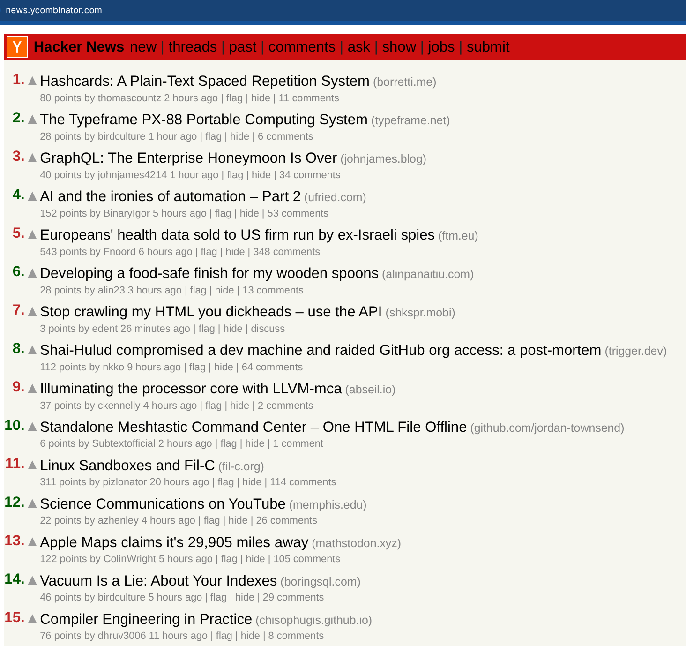
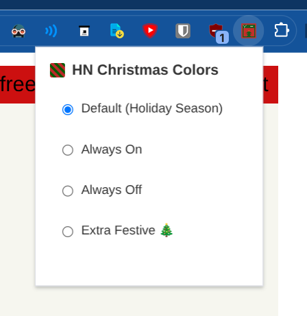
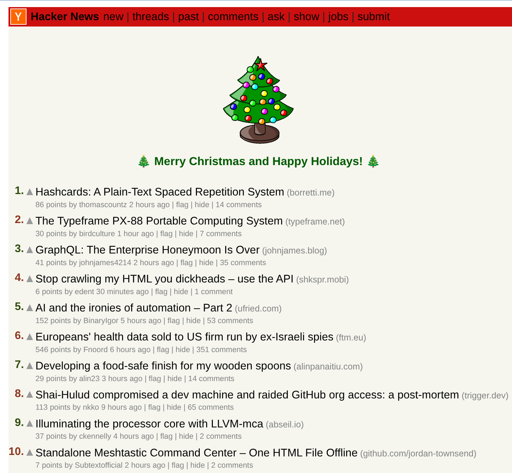

# Hacker News Christmas Colors Browser Extension

  

A browser extension that brings the festive Christmas colors to Hacker News throughout the entire holiday season, not just on Christmas Day.  The "Holiday Season" is defined as the day after Thanksgiving until the first workday of the new year.  (Settings allow you to configure it to be on all year though if you want to 🎁 🎄 🥳, or off.  Easy to toggle to your liking).

## Features

- Automatically applies red and green alternating colors to story numbers on Hacker News
- Changes the top banner to a festive red color
- Active from the day after Thanksgiving through the first workday of the new year
- Works on all pages under news.ycombinator.com
- Compatible with Chrome and Firefox
- Customizable settings with four modes:
  - Default: Active only during holiday season
  - Always On: Christmas colors year-round
  - Always Off: Disable Christmas colors completely
  - Extra Festive: Alternating colors that hold for one second then flip (2s loop; even rows start on green to keep the checkerboard feel), an alternating banner tint, a bundled Wikimedia Commons Christmas tree GIF decoration on story lists (keeps CSP-safe via data URL; suppressed on comment pages), tree emojis before and after every story title, and comment-page usernames that follow the same red/green checkerboard animation with a 🎄 appended to the username/timestamp line

**Heads up:** Extra Festive mode animates multiple elements every second and can noticeably increase CPU usage on long threads. Switch back to Default/Always On if you want lower resource use and preserve battery life when not plugged in.

## Screenshots

  
<em>Normal mode</em>

  

  
<em>Settings</em>

  

  
<em>Extra Festive mode</em>

  

## Installation

### Chrome
1. Open Chrome and navigate to `chrome://extensions/`
2. Enable "Developer mode" in the top right corner
3. Click "Load unpacked"
4. Select this extension's directory
5. The extension will now be active when browsing Hacker News during the holiday season
6. Click the extension icon in the toolbar to access settings and switch between modes

### Firefox
1. Open Firefox and navigate to `about:debugging`
2. Click "This Firefox" on the left sidebar
3. Click "Load Temporary Add-on"
4. Select the `manifest.json` file from this extension's directory
5. The extension will now be active when browsing Hacker News during the holiday season
6. Click the extension icon in the toolbar to access settings and switch between modes

## How It Works

The extension:
- Detects if the current date falls within the holiday season (day after Thanksgiving through first workday of January)
- Applies CSS to alternate story ranking numbers between red (#be2828) and green (#005a00)
- Changes the top banner color to festive red (#cc1010)
- Only activates on news.ycombinator.com domains
- Provides a popup interface to switch between four modes:
  - **Default**: Follows holiday season schedule
  - **Always On**: Keeps Christmas colors active year-round
  - **Always Off**: Disables Christmas colors regardless of date
  - **Extra Festive**: Alternating colors that stay static for one second then flip (2-second loop; even rows start on green), alternating banner tint, tree emojis before/after each story title, commenter usernames that inherit the same red/green checkerboard animation (even comment rows start on green) with a 🎄 appended to the username/timestamp line on comment pages, and the animated [Wikimedia Commons Christmas tree GIF](https://upload.wikimedia.org/wikipedia/commons/f/f9/500px-Xmas_tree_animated.gif) at the top of the story list (suppressed on comment pages), loaded from a bundled copy and injected as a safe data URL. Colors now jump directly between red and green with no gray in-between.

## Development & Testing

- Load the unpacked extension in Chrome (`chrome://extensions`) or run `npx web-ext run --target=firefox-desktop` for Firefox.
- Lint before publishing with `npx web-ext lint`.
- Manual QA on `https://news.ycombinator.com/`: toggle each mode, confirm alternating ranks and banner color, verify ranks jump directly red↔green once per second (odd rows red→green, even rows green→red) and the animated tree appears in Extra Festive mode, and ensure settings persist across tabs (tabs auto-reload after changes).

## Files

- `manifest.json` - Extension configuration
- `content.js` - JavaScript that checks dates and applies the holiday theme
- `christmas.css` - CSS rules for the red/green color alternation
- `popup.html` - Settings popup interface
- `popup.js` - Settings popup logic
- `popup.css` - Settings popup styling
- `icon*.png` - Extension icons in multiple sizes
- `xmas_tree_animated.gif` - Bundled Wikimedia Commons tree GIF that `content.js` converts to a data URL for Extra Festive mode

## License

This project is licensed under the MIT License - see the [LICENSE](LICENSE) file for details.
